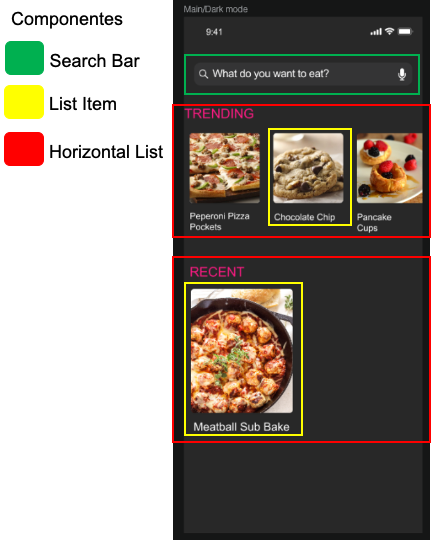

# Recetario de Cocina App

Photo by <a href="https://unsplash.com/@michaelwb?utm_source=unsplash&amp;utm_medium=referral&amp;utm_content=creditCopyText">Michael Browning</a> on <a href="https://unsplash.com/s/photos/cook?utm_source=unsplash&amp;utm_medium=referral&amp;utm_content=creditCopyText">Unsplash</a>

## Objetivo
El objetivo de esta kata es introducirte en el desarrollo de aplicaciones móviles utilizando React Native.

En este primer ejercicio nos estarémos centrando en funcionalidades básicas para una App y empezar a entender a pensar en componentes al momento de trabajar con React Native

Los siguientes recursos, aunque son de react, te sirven para conocer como es que al momento de trabajar con aplicaciones con React Native debes de estructurar tu pensamiento o forma de trabajo en componentes:

- [Thinking in React](https://reactjs.org/docs/thinking-in-react.html)
- [Thinking in React — few tips](https://medium.com/@5066aman/thinking-in-react-few-tips-6b32fbe835a3)
- [Thinking in components - building a todo app](https://softchris.github.io/books/react/thinkingincomponents/)

Otro componente que vas a necesitar es React Navigation, antes de iniciar a codificar revisa el siguiente enlace:
- [React Native Navigation](https://reactnavigation.org/)

También, tendrás que utilizar Hooks, esta es una funcionalidad que recientemente se agregó a React, por lo que también tendrás que estudiar el siguiente enlace:
- [Presentando Hooks](https://es.reactjs.org/docs/hooks-intro.html)

Finalmente, para poder examinar en detalle la ejecución de tu proyecto, te recomendamos aprender a depurar tu proyecto:
- [Debugging](https://reactnative.dev/docs/debugging)

## Pre-requisitos
-  React Native
   - Instalar el entorno de desarrollo [**:warning: utiliza la opción React Native CLI Quickstart NO utilizar Expo**](https://reactnative.dev/docs/environment-setup)
- Editor de texto
  - Elegir un editor para codificar, puede ser [Visual Studio Code](https://code.visualstudio.com/), o algúno similar.
  - Agregar la extensión [Prettier](https://marketplace.visualstudio.com/items?itemName=esbenp.prettier-vscode) para mantener un estilo consistente en tu código
  - Instalar [ESLint](https://eslint.org/) para ayudarte a encontrar y arreglar problemas de tu código
  - Agregar la extensión [Eslint](https://marketplace.visualstudio.com/items?itemName=dbaeumer.vscode-eslint) a tu editor para integrar la funcionalidad de Eslint
- Calidad de código. Para analizar la calidad de tu código necesitarás
  - Instalar y configurar [CodeClimate](https://codeclimate.com/) para analizar tu codigo y mejorar la calidad atendiendo los resultados del análisis
  
## Requerimientos funcionales
  
  La empresa Foo Corp necesita una App para poder visualizar las recetas de cocina de sus restaurantes. La App deberá cumplir con los siguientes requerimientos:
  
- Pantalla principal 
  - Listado con las recetas que están de moda (trending)
  - Listado con las recetas más recientes 
  - Por cada receta se debe mostrar una foto del platillo de la receta y el nombre de la receta
- Pantalla detalle
  - Foto del platillo de la receta
  - Categoría de la receta (trending/recent)
  - Nombre de la receta
  - Porciones por receta (servings)
  - Listado de ingredientes con nombre y cantidad
  - Botón "me gusta" que servirá para etiquetar a las recetas favoritas
   
## Requerimientos no-funcionales
- Base de datos
  - Los datos (recetas) se tomarán de un archivo local en formato JSON 
- Calidad
  - Utilizar un estilo de código estandarizado (revisado por Eslint)
  - Puntuación **A** obtenida en [CodeClimate](https://codeclimate.com/)
- Ejecución 
  - Puede ejecutarse en Android o iOs
- Código fuente
  - Orientado a Objetos
  - Métodos pequeños
  - Aplicar los principios [SOLID](https://blog.usejournal.com/how-to-apply-solid-principles-in-react-applications-6c964091a982)
  

## Tecnologías
- [React Native CLI](https://reactnative.dev/docs/environment-setup)
- [React Native Navigation](https://reactnavigation.org/)
- [Hooks](https://es.reactjs.org/docs/hooks-intro.html)

## Diseño

En la carpeta [img](/img) se encuentra el diseño solicitado en formato PNG E Invision.

## Flujo de trabajo sugerido

- Divide tu trabajo en pequeñas tareas
- Para cada pantalla identifica o clasifica los diferentes compones que se presentan
- Inicia programando los componentes individuales procurando que estos sean reutilizables
- Una vez que tienes listos los componentes integra las pantallas.

Por ejemplo la primer pantalla se puede subdividir en los siguientes 3 componentes
- Search Bar. La barra que se encuentra en la parte suberior
- List Item. Cada elemento que se muestra dentro de las listas
- Horizontal List. Lista scrollable horizontal que incluye las recetas dependiendo de la categoría.

Al ser reutilizables `List Item` y `Horizontal List`pueden servir tanto para trending como para recent, simplemente incluyendo propiedades que permitan indicar el alto del componente así como su contenido (lista de recetas).

## Entregable
- Código fuente en Github (en la rama master)
- Incluir en el repositorio la puntuación obtenida (badge) en CodeClimate
- [Los commits deben se significativos](https://medium.com/better-programming/you-need-meaningful-commit-messages-d869e44e98d4)

## Demo

## Recursos
[Para apoyo de tus actividades utiliza esta lista de recursos recomendados](https://github.com/bright-coders/commons/tree/master/topics/resources-react-native)
  
